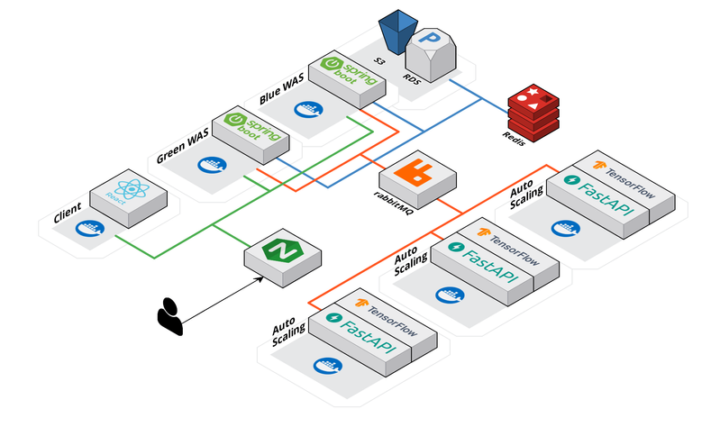

# 아이캔버스(AICanvas)

💡 아이들이 스케치를 그리면 생성형 AI가 이를 그림으로 변환해 주는 서비스입니다. 게임적인 요소를 더해 아이들이 스스로 자신만의 콘텐츠를 생성하면서 자신감과 창의력을 증진하고, 재미와 성취감을 경험할 수 있도록 합니다.  

 

- 모델에 대한 자세한 설명이 궁금하신 분은 [여기](./ml/README.md)를 참고해 주세요

# 기능 소개

- Gamification & 아이들 친화적인 UI로 구성했습니다

|                    그림 변환                     | 주제별 그리기 |
|:--------------------------------------------:|:---:|
|  ||

 

- 아이들의 흥미를 유발하기 위한 게임적 요소 

|                     단계별 그리기                      | 채점 |
|:------------------------------------------------:|:---:|
|  ||

 

- 그린 그림을 게시하고 좋아요를 받아서 랭킹에 들 수 있습니다 

| 랭킹 그림 조회 | 주제별 그림 조회 | 알림 기능 |
|:---:|:---:|:---:|
||||

 

- 또한 이를 카카오톡으로도 공유할 수 있습니다 

| 카카오톡 공유하기 |
| :---: |
|  |

 

# 개발

### 1. 개발 기간

> 🗓️ 2023.08.21 ~ 2023.10.06

### 2. ERD

### 3. 시스템 아키텍쳐

### 4. 활용 스택

### 5. 팀원 소개

 
