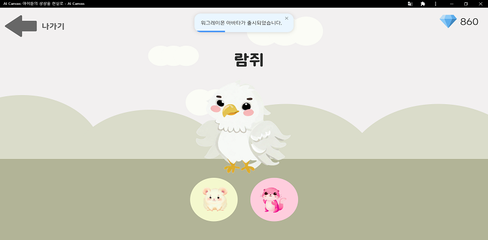
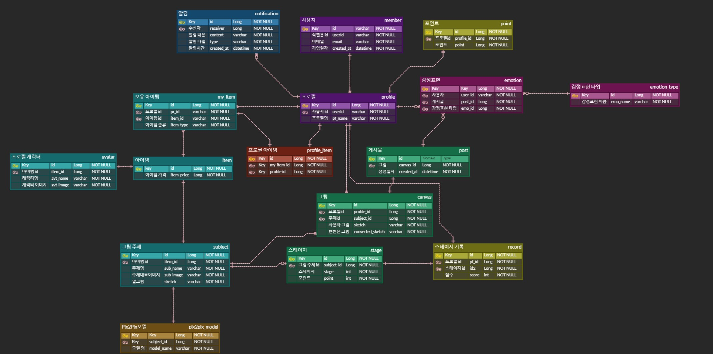
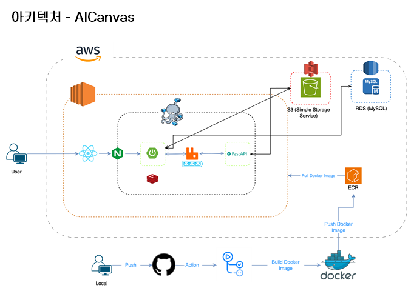

# 아이캔버스(AICanvas)

💡 아이들이 스케치를 그리면 생성형 AI가 이를 그림으로 변환해 주는 서비스입니다. 게임적인 요소를 더해 아이들이 스스로 자신만의 콘텐츠를 생성하면서 자신감과 창의력을 증진하고, 재미와 성취감을 경험할 수 있도록 합니다.  

 

- 모델에 대한 자세한 설명이 궁금하신 분은 [여기](./ml/README.md)를 참고해 주세요

# 기능 소개

- Gamification & 아이들 친화적인 UI로 구성했습니다

|                    그림 변환                     | 주제별 그리기 |
|:--------------------------------------------:|:---:|
|  ||

 

- 아이들의 흥미를 유발하기 위한 게임적 요소 

|                     단계별 그리기                      | 채점 |
|:------------------------------------------------:|:---:|
|  ||

 

- 그린 그림을 게시하고 좋아요를 받아서 랭킹에 들 수 있습니다 

| 랭킹 그림 조회 | 주제별 그림 조회 | 알림 기능 |
|:---:|:---:|:---:|
||||

 

- 또한 이를 카카오톡으로도 공유할 수 있습니다 

| 카카오톡 공유하기 |
| :---: |
|  |

 

# 개발

### 1. 개발 기간

> 🗓️ 2023.08.21 ~ 2023.10.06

### 2. ERD

### 3. 시스템 아키텍쳐

### 4. 활용 스택

### 5. 팀원 소개

#### BE 팀원 소개

* [이명우](https://github.com/Fishphobiagg)
  * 역할 및 기여
    * RESTful API(REST API 2단계 모델)
      * 그림 API
        * 그림 변환 API
          * S3 (Simple storage service)
        * 채점 기능
          * Java + GoogleVisionAPI의 label detection으로 구현
      * 게시물 API
        * 감정표현하기 
        * 게시물 CRUD
        * 주제별 게시물 조회
          * querydsl 활용하여 N + 1 문제 해결 
        * 랭킹 조회
          * 1시간마다 랭킹 통계 쿼리 -> Redis에 저장
    * 메시지 큐
      * 메시지 브로커 : RabbitMQ
      * 프로시저 : fastAPI, Spring Boot
      * 리스너 : fastAPI, Spring Boot
    * 설계
      * ERD 설계 및 테이블 생성
      * 아키텍처 설계

* [엄한결](https://github.com/ah9mon)
  * **역할 및 기여**
    * **Back-end**
      * Restful API(REST API 2단계 모델)
        * 상점 기능
          * 아바타 구매
          * 그림 주제 구매
          * 포인트 기능
        * 단게별 그리기
          * 스테이지 조회
          * 스테이지 클리어
        * 아이템
          * 내 아이템 API(그림, 아바타)
      * SSE 활용한 실시간 알림
        * 랭킹 진입 알림
        * 신규 아이템 출시 알림
      * 인증/인가 구현
        * JWT + OAuth2 + Spring Security 활용한 인증/인가 필터 구현
        * 카카오 로그인 API 활용한 소셜 로그인 구현
        
    * **Infra**
      * github action 배포 자동화 + 인프라 환경 구성
        * AWS ECR
        * EC2(개발, 운영 서버 분리)
        * Docker Compose
          * Redis, RabbitMQ, Nginx 컨테이너 환경에서 실행
      * RDS 
        * MySQL 환경 구성
    * 설계
      * ERD 설계 및 테이블 생성
      * 아키텍처 설계

* [조현기](https://github.com/chk7082)
  * 역할 및 기여
    * AI 
    * [모델 개발 과정 상세 링크](https://github.com/chk7082/AICanvas-Pix2Pix#%EB%8D%B0%EC%9D%B4%ED%84%B0-%EC%A0%84%EC%B2%98%EB%A6%AC)
      * 데이터 수집 및 전처리(6개 그림 주제, 약 27만장)
        * HED 활용하여
      * Pix2Pix 모델 논문 구현
      * 6개 주제 모델 학습
        * GPU로 학습 & CPU로 데이터 로딩 병렬 처리
    * **Back-end**
      * fastAPI 서버 개발
 
